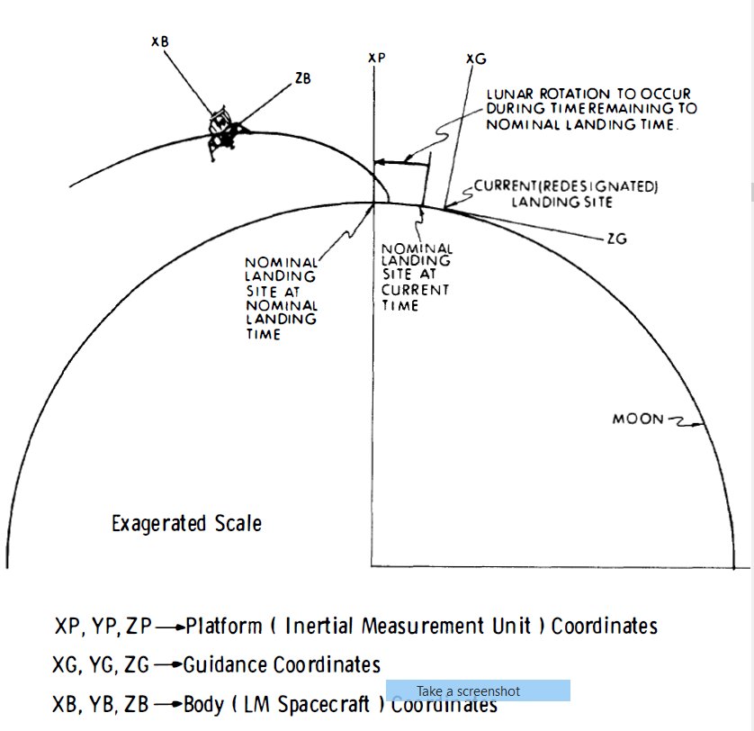
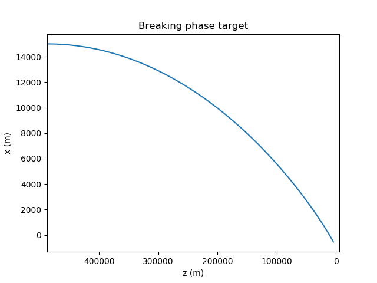
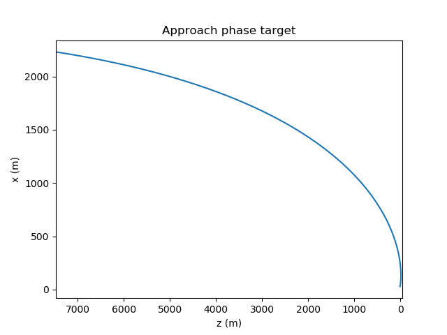
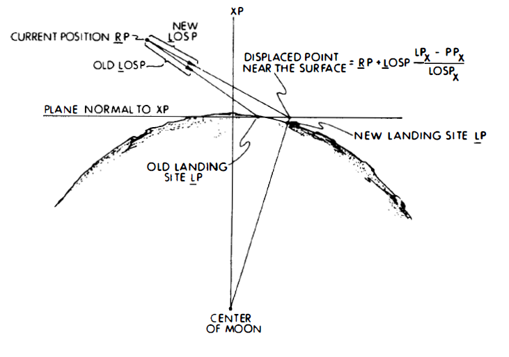

# Apollo Lunar-Descent Guidance

This is the implementation of the Apollo guidance used for Lunar descent. The lunar-descent begins with the lunar module (LM), which follows an elliptical orbitat an altitude of about 15 km, and it ends in the lunar surface.

## Descent phases

1. Braking phase (P63). In this phase the program computes the time and attitude for ignition.

2. Approach phase (P64): This phase transfers the LM to a point almost directly above the landing site, and provides visibility of the lunar surface during all the phase.

3. The terminal-descent phase (P66): This phase begins at around 30m altitude and 11m ground range from the landing site. This phase controls only the velocity, and produces the vertical approach to the surface.

## Navigation, Guidance and Control

### Navigation

The Navigation provides the current state vector based on data from an inertial measurement unit, and a landing radar.

### Guidance

Guidance transfers the LM from the current state to the terminal condition of the current phase, and is based on precomputed targets from the ground-based targeting progam.

<!-- $\underline{L}_P$ : Landing site position

$\underline{W}_{MOON_P}$: Lunar angular velocity

$CGP$:

$\underline{R}_P$: Current state in platform coordinates

$\underline{R}_G$: Current state in Guidance coordinates

$\underline{V}_P$: Current velocity in platform coordinates

$\underline{V}_G$: Current velocity in Guidance coordinates

$t_{OLD}$: clock-time of the preceding update

$V_{TG_z}$: Target position

$R_{TG_z}$: Target velocity

$A_{TG_z}$: Target acceleration

$J_{TG_z}$: Target jerk

$\underline{G}_M$: Lunar gravity at the surface

$\underline{G}_P$: Gravity at the current position

$\underline{U}_{NFCP}$: Unit thrust command

$\underline{U}_{NWCP}$: Unit window command

$\underline{L}_{OSP}$: Unit line-of-sight vector to the current landing site

$NCAZ$: Azimuth command count

$NCEL$: Elevation command count

$V_{MOON}$: Lunar surface velocity -->

## Lunar Descent Coordinate Frames

- Platform Coordinates: The origin is at the center of the moon, the x-axis aims at the landing siteat the nominal landing time, the z-axis is parallel to the orbital plane of the Command Module. Platform coordinates are non-rotating.

- Guidance coordinates: The origin coincides with the current landing site (the frame rotates with the moon). The x-axis is vertical and the z-axis lies in the plane containing the landing site and the LM. The matrix CGP rows are the vectors $\underline{C}_{GP_X}$, $\underline{C}_{GP_Y}$, $\underline{C}_{GP_Z}$, which are the guidance-frame unit vectors.

- Body coordinates: These are the LM coordinates. The x-axis is in the direction of the nominal thrust vector, and the z-axis is directed forward. The matrix CGP rows are the vectors $\underline{C}_{BP_X}$, $\underline{C}_{BP_Y}$, $\underline{C}_{BP_Z}$, which are the body-frame unit vectors.

<!--  -->

## Braking-Phase
 Guiding a spacecraft from any initial or current position to a specified target state can be done through an explicit guidance or implicit guidance. In explicit guidance, we can determine at every point of the mission the function of time that intersect the current and target position, and the guidance can create commands of the acceleration vs time. In implicit guidance, we define in advance of the mission  a reference trajectory as a function of time that evolves backwards from the target state but cannot epected to intersect the current state. The onboard guidance the creates commands of acceleration proportional of the deviation of the velocity and position of the actual trajectory with respect the reference trajectory.

 Here an implicit guidance equation is used, and deviations come from navigation errors , where rapid reduction of deviations restores the trajectory to the target trajectory.

 We want to define the trajectory that satisfies a two-point boundary problem with five degrees of freedom for each of the three components.

 $$\underline{R}_{RG} = \underline{R}_{TG} + \underline{V}_{TG}T + \underline{A}_{TG}T^2/2 + \underline{R}_{JG}T^3/5 + \underline{S}_{TG}T^4/24$$

 where $\underline{R}_{RG}$ is the position vector of the reference trajectory in guidance coordinates, and TG means the target state in guidance coordinates.

 The acceleration to be commanded at any point in space is:

 $$\underline{A}_{CG} = \underline{A}_{TG} + \underline{J}_{TG}T + \underline{S}_{TG}T^2/2 - (\underline{V}_{G} - \underline{V}_{TG} - \underline{A}_{TG}T - \underline{J}_{TG}T^2/2 - \underline{S}_{TG}^3/6)K_V/T - (\underline{R}_{G} - \underline{R}_{TG} - \underline{V}_{TG}T - \underline{A}_{TG}T^2/2 - \underline{J}_{TG}T^3/6 - \underline{S}_{TG}T^4/24)K_R/T^2$$

 where $\underline{R}_{G}$ and $\underline{V}_{G}$ are the current position and velocity, and $K_V$ and $K_R$ are the feedback gains.

 ## P63, P64 Guidance algorithm

The algorithm receives the guidance targets, the current state vector, and the gravity vector as inputs and issues the thrust acceleration command.

### Update landing site vector for lunar rotation

The landing site vector is updated for the lunar rotation using an approximate algorithm that accounts for the lunar rotation.

$$ \underline{L}_P  = L_{P_{UNIT}}[\underline{L}_P + (t - t_{OLD})\underline{W}_{MOON_P}\underline{L}_P]$$

### Compute current state vector in Guidance coordinates

$$ \underline{R}_G = CGP(\underline{R}_P - \underline{L}_P)$$

$$ \underline{V}_G = CGP(\underline{V}_P - \underline{W}_{MOON_P}\underline{R}_P)$$

### Update Target-Referenced Time T

$$ T = T + (t - t_{OLD})$$
$$ t_{OLD} = t$$

### Convergence Criterion
$$ \Delta T_{CRIT} = T / 128$$

while $|\Delta T|$ > $\Delta T_{CRIT}$:

$$ \Delta T = - \frac{J_{TG_z}T^3 + 6 A_{TG_z}T^2 + (18 V_{TG_z} + 6 V_{G_z})T + 24(R_{TG_z} - R_{G_z})}{3 J_{TG_z}T^2 + 12 A_{TG_z} + 18 V_{TG_z} + 6 V_{G_z}}$$

$$ T = T + \Delta T$$

### Guidance Equation

$$ T_P = T + T_{LEADTIME}$$

$$ \underline{A}_{CG} = [3(\frac{T_P}{T})^2 - 2(\frac{T_P}{T})]12(\underline{R}_{TG} - \underline{R}_{G})$$

$T_{LEADTIME}$ is the transport delay due to computation and command execution.

$$ T_{LEADTIME} \approx 0$$

### Compute Thrust-Acceleration Command and Unit thrust Command

$$\underline{A}_{FCP} = C_{PG}(\underline{A}_{CG}) - \underline{G}_{P}$$

$$\underline{A}_{FCP} = |\underline{A}_{FCP}|$$

$$ \underline{U}_{NFCP} = UNIT(\underline{A}_{FCP})$$

### Compute Unit Window Command

$$ \underline{F}_{ORP} = UNIT(\underline{C}_{BP_X } \times \underline{C}_{GP_Y })$$

$$ PROJ = \underline{L}_{OSP} \times \underline{C}_{BP_X } \cdot \underline{C}_{GP_Y }$$

$$ \underline{U}_{NWCP} = UNIT(MAXIMUM(PROJ - cos(65º), 0)\underline{L}_{OSP} + MAXIMUM(cos(75º) - PROJ)\underline{F}_{ORP})$$

## Targeting 

For the braking phase we require a targeting algorithm to generate the target used in the guidance.

The targeting program computes the targets by projecting computed terminal conditions forward typically 60 seconds. They are computed to have the required terminal conditions on a terminal trajectory.

The targeting is a boundary problem with the initial and final conditions. It's going to be approximated by a polynomial of five degrees of freedom for the 5 conditions. We have the current position and velocity, and the final position, velocity and acceleration.

$$ R = R_0 + V_0*T + A_0 / 2*T^2 + J_0/6*T^3 + S_0/24*T^4$$

With the boundary conditions we will obtain a system of five equation with five variables that we can solve to get the trayectory, and we can obtain the target.

The boundary conditions at terminal T are:

$$R(T_f) = (-541, 4416) m$$

$$V(T_f) = (0, 0) m/s$$

$$A(T_f) = (0, 0) m/s$$

The angle is small enough that we can discard the curvature, the chord is very close the the arc. But it's not hard to make the coordinates transformation to obtain the correct values.

#### Approach Phase Target

$$ T_0 = 177 s$$

$$R(T_0) = R(T_0)_{P63_{Target}}$$

$$V(T_0) = V(T_0)_{P63_{Target}}$$

$$R(T_f) = (29, 4.8) m$$

$$V(T_f) = (0, 0) m/s$$

$$A(T_f) = (0, 0) m/s$$

## P64

### Landing-site Redesignation Algorithm

$$\underline{L}_{OSP}  = UNIT(\underline{L}_P - \underline{R}_P)$$

$$\underline{L}_{OSP}  = \underline{L}_{OSP} + 0.01745 \cdot  NCAZ \cdot \underline{C}_{BP_Y} + 0.01745 \cdot  NCEL ( \underline{C}_{BP_Y} \times \underline{L}_{OSP})$$

$$ NCAZ = 0, NCEL = 0$$

$$ L_{OSP_X} = MIN(L_{OSP_X}, -0.02)$$

$$ $$\underline{L}_{OSP}  = UNIT(\underline{L}_{OSP})$$

$$ \underline{L}_P = L_P \cdot UNIT(\underline{R}_P + \underline{L}_{OSP} \frac{L_{P_X} - R_{P_X}}{L_{OSP_X}})$$

If the commander manipulates the controller in the automatic mode, the LGC is interrupted and NCAZ, azimuth command count, or NCEL, elevation command count, is incremented or decremented according to the direction of manipulation. The algorithm rotates $\underline{L}_{OSP}$ (the unit line-of-sight vector to the current landing site) by 1º.

### Landing Point Designator Angle Display

$$ \theta_{LPD} = - \arcsin{\underline{L}_OSP - \underline{C}_{BP_X}}$$

### Recalculate Guidance Coordinate Frame

$$\underline{C}_{GP_X} = UNIT(\underline{L}_P) $$

$$\underline{C}_{GP_Y} = UNIT(\underline{L}_P \times (\underline{R}_P - \underline{L}_P - K(\underline{V}_P - \underline{W}_{MOON_P} \times \underline{R}_P)T/4))$$

$$\underline{C}_{GP_Z} = \underline{C}_{GP_X} \times \underline{C}_{GP_Y}$$

# Terminal-Descent-Phase Guidance

The vertical and horizontal velocities are controlled independently.

## P66 Horizontal Guidance Algorithm

It assumes that the vertical component of the thust-acceleration equals lunar gravity.
P66 Horizontal Guidance Algorithm aims to null the horizontal component of the velocity relative to the lunar surface direnting the thrust vector a small angle away from the vertical.

The direction of the thrust-acceleration command is limited to 20º from the vertical.

### Compute Unlimited Thrust-Acceleration Command

$$ A_{FCP_X} = G_M$$

$$ A_{FCP_Y} = - (V_{P_Y} - V_{MOON_{P_Y}})/5 - 0.4*A_{FCP_Y}$$

$$ A_{FCP_Z} = - (V_{P_Z} - V_{MOON_{P_Z}})/5 - 0.4*A_{FCP_Z}$$

### Limit Commanded Trhust Direction to 20º From Vertical

$$ A_{FCP_Y} = LIMIT(A_{FCP_Y}, A_{FCP_X}*\tan{20º})$$

$$ A_{FCP_Z} = LIMIT(A_{FCP_Z}, A_{FCP_X}*\tan{20º})$$

### Unit Thrust-Command
$$ \underline{U}_{NFCP} = UNIT(\underline{A}_{FCP})$$

## P66 Vertical (ROD) Guidance Algorithm

It controls attitude rate to the reference value by throttling the DPS (Descent propulsion system).

### Compute Existing Vertical Acceleration at ROD Sample Instant
 
 $$ A_{P_X} = A_{FP_X} + C_{BP_XX}\delta F_A / M + G_{P_X}$$

 ### Extrapolate Sample-Instant Measured Velocity By Effective Transport Lag

 $$ V_{P_X} = V_{P_X} + A_{P_X}0.35$$

 ### Update Commanded Vertical Velocity Incorporating ROD Inputs

 $$ V_{CP_X} = V_{CP_X} + 0.3 N_{ROD}$$

 $$ N_{ROD} = 0$$

 ### Compute Thrust-Acceleration Command for Throttle Routine

 $$ A_{FCP} = \frac{-(V_{P_X} - V_{CP_X})/1.5 - G_{P_X}}{C_{BP_{XX}}}$$

 ### Restrict Thrust-Acceleration Command to Produce Thrust

 $$ A_{FCP} = MAX(A_{FCP}, 0.093*46706 / M)$$

  $$ A_{FCP} = MIN(A_{FCP}, 0.6*46706 / M)$$